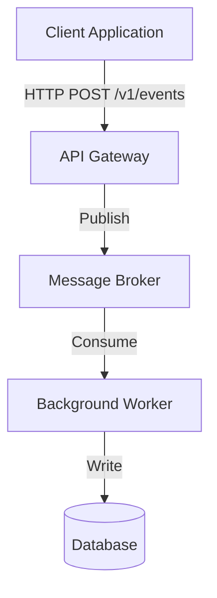

<!-- 
Template Source: Inspired by Google's Software Design Doc Guidelines & Tanya Reilly's RFC Standard
-->

# TDD: [Title]

---
**Status:** [DRAFT | IN REVIEW | APPROVED | SUPERSEDED] <br />
**Version:** [e.g., 0.1] <br />
**Date:** [YYYY-MM-DD] <br />
**Author:** [Name Surname] <br />
**Related PRD:** [Link to PRD] <br />
**Related ADRs:** [Link to ADRs]
---

## 1. Overview & Objectives

*Keep this high-level. A 3-sentence summary of what technical system/change is being built and why.*

### 1.1. Goals

* *What must this technical implementation successfully achieve?*
* *e.g., Support P95 write latencies under 50ms.*

### 1.2. Non-Goals

* *What are we explicitly NOT implementing or optimizing for in this design?*
* *e.g., We are not designing for auto-scaling database nodes in this phase.*

## 2. System Architecture

*Describe the components and how they interact. A Mermaid.js diagram is highly recommended here.*



### 2.1. Component Breakdown

* *[Component A]: What is its responsibility? (e.g., API Service).*
* *[Component B]: What is its responsibility? (e.g., Worker Daemon).*

### 2.2. Data Flow & Sequence

*Step-by-step walk-through of how data travels through the system during a core operation.*

## 3. Implementation Details

### 3.1. Interface Contracts (APIs / Events)

*Include endpoint paths, HTTP verbs, payload structures, and expected response codes.*

* *Endpoint: `POST /v1/notifications`*
* *Request Payload:*
  ```
  {
      "recipient_id": "usr_123456",
      "channel": "EMAIL",
      "template_id": "tpl_welcome",
      "variables": {
          "fullname": "Elvin Taghziade"
      }
  }
  ```

* *Response Payload: `200 OK`*
  ```
  {
      "notification_id": "not_987654",
      "status": "SENT"
  }
  ```

### 3.2 Database & Schema Design

Describe the entities and relationships.

- Table: `[Name]`
    - Column | Type | Constraints

## 4. Risks & Mitigations

What could break at the implementation level? (e.g., race conditions, db deadlocks).

## 5. Implementation Steps

A checklist for the actual coding (Breaking the task into PR-sized chunks).