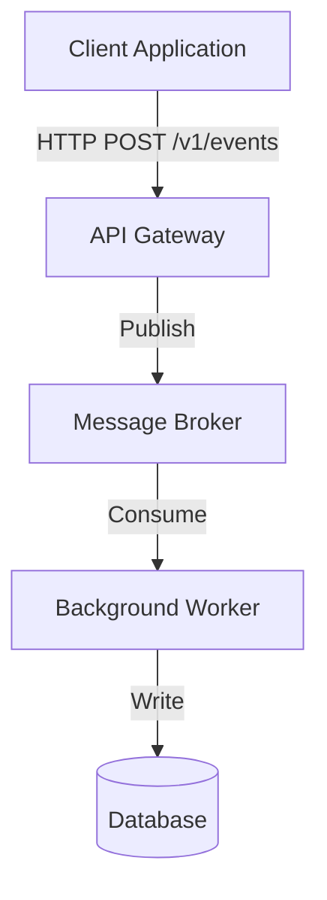

<!-- 
Template Source: Inspired by Google's Software Design Doc Guidelines & Tanya Reilly's RFC Standard
-->

# TDD: [Title]

---
**Status:** [DRAFT | IN REVIEW | APPROVED | SUPERSEDED] <br />
**Version:** [e.g., 0.1] <br />
**Date:** [YYYY-MM-DD] <br />
**Author:** [Name Surname] <br />
**Related PRD:** [Link to PRD] <br />
**Related ADRs:** [Link to ADRs]
---

## 1. Overview & Objectives

*Keep this high-level. A 3-sentence summary of what technical system/change is being built and why.*

### 1.1. Goals

* *What must this technical implementation successfully achieve?*
* *e.g., Support P95 write latencies under 50ms.*

### 1.2. Non-Goals

* *What are we explicitly NOT implementing or optimizing for in this design?*
* *e.g., We are not designing for auto-scaling database nodes in this phase.*

## 2. System Architecture

*Describe the components and how they interact. A Mermaid.js diagram is highly recommended here.*



### 2.1. Component Breakdown

* *[Component A]: What is its responsibility? (e.g., API Service).*
* *[Component B]: What is its responsibility? (e.g., Worker Daemon).*

### 2.2. Data Flow & Sequence

*Step-by-step walk-through of how data travels through the system during a core operation.*

## 3. Implementation Details

### 3.1. Interface Contracts (APIs / Events)

*Include endpoint paths, HTTP verbs, payload structures, and expected response codes.*

* *Endpoint: `POST /v1/notifications`*
* *Request Payload:*
  ```
  {
      "recipient_id": "usr_123456",
      "channel": "EMAIL",
      "template_id": "tpl_welcome",
      "variables": {
          "fullname": "Elvin Taghziade"
      }
  }
  ```

* *Response Payload: `200 OK`*
  ```
  {
      "notification_id": "not_987654",
      "status": "SENT"
  }
  ```

### 3.2 Database & Schema Design

*Define the tables, key fields, indexes, and relationships.*

#### Table: `[name]`

| Column Name    | Type        | Constraints     | Description             |
|----------------|-------------|-----------------|-------------------------|
| `id`           | UUID        | PRIMARY KEY     | Unique identifier       |
| `recipient_id` | VARCHAR(64) | NOT NULL, INDEX | Target user             |
| `status`       | VARCHAR(24) | NOT NULL        | Current dispatch status |
| `created_at`   | TIMESTAMPTZ | DEFAULT NOW()   | Audit timestamp         |

* **Indexes:** e.g. `idx_notifications_recipient_status` on `(recipient_id, status)`.
* **Migrations:** *Briefly note any complex migration paths or schema breaking changes.*

## 4. Scale, Security & Reliability

### 4.1. Scale & Performance

* *How does this design handle load? (e.g., caching strategies, rate-limiting, DB connection pooling).*

### 4.2. Failure Modes & Mitigations

* *What happens when things break?*
* *e.g., If the database drops, the background worker will store failed payloads in an in-memory dead-letter queue and
  retry using an exponential backoff.*

### 4.3. Security & Data Protection

* *How are we securing endpoints and protecting sensitive data? (e.g., API key validation, encrypting PII).*

## 5. Observability & Monitoring

### 5.1. Log Events

* *What are the critical, structured log lines we must output?*
* *e.g., `[INFO] Notification queued. notification_id=XYZ channel=email`*

### 5.2. Metrics & Alerts

* *Key metrics we need to emit (e.g., Prometheus metrics).*
* `notification_delivery_failed_total` (Alert if > 1% over 5m window).
* `notification_latency_seconds_bucket`.

## 6. Implementation Plan

*How do we build this incrementally? Break the work down into logical PR-sized chunks to make reviews easier.*

* [ ] **Phase 1: DB Migration & Models** (Build out the schema and raw database adapter layer).
* [ ] **Phase 2: Core Business Logic & Unit Tests** (Validation logic, message payload serialization).
* [ ] **Phase 3: HTTP API Interface** (Expose endpoints, middleware, authentication).
* [ ] **Phase 4: Worker Engine** (Consumer daemon, integration with mock third-party drivers).
